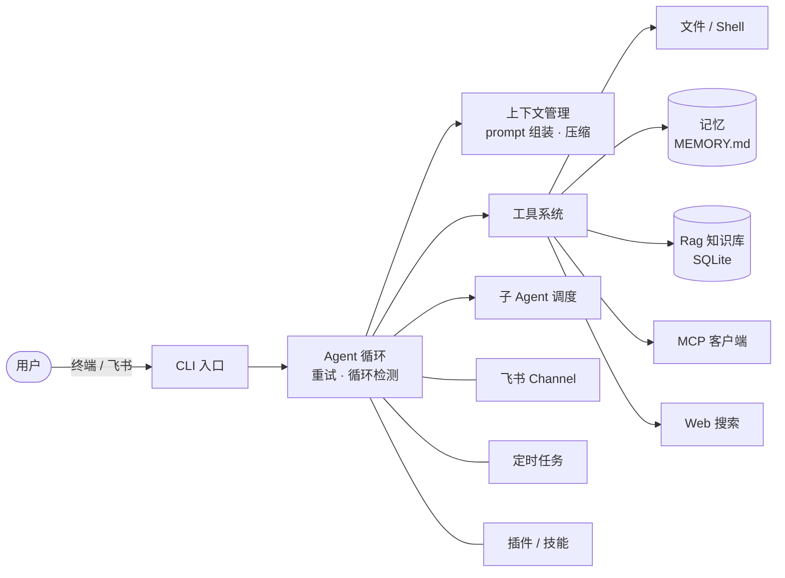

<div align="center">


# RuneClaw

** 一个运行在本地的 Super Agent，通过命令行工具进行交互，也可接飞书、带记忆与 RAG、可插拔工具/插件、能派发子 Agent，核心能力对齐 OpenClaw。**

模型调用 · 文件工具 · RAG · 记忆 · MCP · 子 Agent · 定时任务 · 插件 · 飞书通道

[](https://www.npmjs.com/package/@xiaodye/runeclaw)
[](#许可证)

[](https://www.typescriptlang.org)
[](https://nodejs.org)
[](https://pnpm.io)
[](https://github.com/vadimdemedes/ink)
[](https://ai-sdk.dev)
[](https://sqlite.org)

</div>

---

RuneClaw 是一个基于 TypeScript 的本地 AI Agent CLI。它把模型调用、文件工具、RAG、记忆、MCP、子 Agent、定时任务、插件和飞书通道放在同一个运行时里，适合做可迭代的个人 Agent 实验。


## ✨ 特性

| 能力           | 说明                                                         |
| -------------- | ------------------------------------------------------------ |
| 🤖 模型接入    | DeepSeek 兼容模型，默认使用 `deepseek-v4-flash`              |
| 💬 交互式 CLI  | 多轮对话 + 工具调用，基于 Ink 的终端 UI                      |
| 📂 文件工具    | 读取、写入、编辑、列目录、grep、glob                         |
| 🐚 Shell 工具  | 执行命令并返回输出，带安全钩子与审计日志                     |
| 🧠 记忆系统    | 跨会话保存、读取、搜索记忆                                   |
| 📚 RAG 知识库  | SQLite 向量 + 全文检索，启动时加 `--rag` 自动导入 `docs/`    |
| 🔌 MCP 接入    | 可挂载外部工具，当前默认有 GitHub mock 示例                  |
| 🪆 子 Agent    | 任务分发与执行记录查看                                       |
| ⏰ 定时任务    | 查看 cron 任务与执行日志                                     |
| 🧩 插件 / 技能 | 动态加载与卸载，飞书 Channel、上下文视图、用量统计、循环检测 |

## 🏗️ 架构总览



## 📦 环境要求

- Node.js 22+
- `pnpm` 10.x

## 🚀 快速开始

### 1. 安装

```bash
pnpm install
pnpm build          # 编译到 dist/（bin 指向 dist/index.js）
```

开发时直接跑源码、不用每次编译：

```bash
pnpm run dev        # 等价于 tsx src/index.ts
```

把 `runeclaw` 注册成全局命令（二选一）：

```bash
# 方式一：全局安装（推荐，任意目录都能用）
pnpm add -g .

# 方式二：开发时链接本地项目
pnpm link --global
```

> 不想注册全局命令的话，也可以用 `pnpm exec runeclaw` 直接运行。
> 修改源码后重新执行 `pnpm build` 即可让全局命令生效。

### 2. 初始化并启动

```bash
runeclaw init       # 运行初始化向导，生成 runeclaw.config.json 与 .env
runeclaw            # 启动交互式 Agent
```

如果你已经有完整的配置文件，也可以直接启动。

### 3. 从 npm 安装（发布后）

```bash
npm install -g @xiaodye/runeclaw
runeclaw init
runeclaw
```

### CLI 命令

| 命令                             | 说明                                                  |
| -------------------------------- | ----------------------------------------------------- |
| `runeclaw` / `runeclaw start`    | 启动交互式 Agent（默认）                              |
| `runeclaw init`                  | 运行初始化向导，生成 `runeclaw.config.json` 与 `.env` |
| `runeclaw continue`              | 启动 Agent（预留会话续接）                            |
| `runeclaw help` / `--help`       | 查看帮助                                              |
| `runeclaw version` / `--version` | 查看版本号                                            |

## ⌨️ 会话内常用命令

<details open>
<summary><b>基础</b></summary>

| 命令       | 说明                           |
| ---------- | ------------------------------ |
| `/exit`    | 退出                           |
| `/context` | 查看上下文占用                 |
| `/usage`   | 查看 token 和成本统计          |
| `status`   | 查看当前消息、记忆和知识库状态 |

</details>

<details>
<summary><b>记忆</b></summary>

| 命令                      | 说明         |
| ------------------------- | ------------ |
| `/memory`                 | 查看记忆列表 |
| `/memory search <关键词>` | 搜索记忆     |

</details>

<details>
<summary><b>知识库</b></summary>

| 命令            | 说明                 |
| --------------- | -------------------- |
| `/rag`          | 查看知识库状态       |
| `ingest <path>` | 导入本地文档到知识库 |

</details>

<details>
<summary><b>技能与插件</b></summary>

| 命令                        | 说明     |
| --------------------------- | -------- |
| `/skill` 或 `/skill list`   | 查看技能 |
| `/skill load <name>`        | 激活技能 |
| `/skill unload <name>`      | 卸载技能 |
| `/plugin` 或 `/plugin list` | 查看插件 |
| `/plugin load <name>`       | 加载插件 |
| `/plugin unload <name>`     | 卸载插件 |

</details>

<details>
<summary><b>通道、定时任务、子 Agent</b></summary>

| 命令           | 说明                  |
| -------------- | --------------------- |
| `/channel`     | 查看已注册通道        |
| `/cron`        | 查看定时任务          |
| `/cron logs`   | 查看最近执行日志      |
| `/agents`      | 查看子 Agent 执行记录 |
| `/role [角色]` | 查看或切换角色        |

</details>

<details>
<summary><b>调试</b></summary>

| 命令                      | 说明            |
| ------------------------- | --------------- |
| `sim` 或 `模拟长对话`     | 注入测试对话    |
| `defend` 或 `执行防线`    | 应用上下文防线  |
| `/cache on`、`/cache off` | 切换 cache 模拟 |

</details>

## ⚙️ 配置说明

初始化后会生成两个文件：

- `runeclaw.config.json`
- `.env`

约定是：

- `runeclaw.config.json` 只保留占位符，不放明文密钥
- 真正的模型和飞书密钥放在 `.env`

配置文件里的 `${LLM_MODEL}`、`${LLM_API_BASE}`、`${LLM_API_KEY}`、`${FEISHU_APP_ID}`、`${FEISHU_APP_SECRET}` 会在启动时自动从环境变量替换。

### 推荐的 `.env`

```bash
LLM_MODEL=deepseek-v4-flash
LLM_API_BASE=https://api.deepseek.com
LLM_API_KEY=your-deepseek-api-key

FEISHU_APP_ID=cli_xxx
FEISHU_APP_SECRET=xxx

DASHSCOPE_API_KEY=your-dashscope-api-key-for-embeddings

TAVILY_API_KEY=
# 或者
SERPER_API_KEY=
```

### 模型选择

`runeclaw init` 会默认提供这些 DeepSeek 模型：

- `deepseek-v4-flash`
- `deepseek-v4-pro`
- 自定义模型名

如果你手动编辑配置，也建议继续使用 DeepSeek 的 OpenAI-compatible 接入方式。

## 📤 发布到 npm

包名是 `@xiaodye/runeclaw`，`publishConfig.access: public` 已配置好（scoped 包默认私有，必须显式公开）。

一键发布（`scripts/release.mjs` 自动完成：**版本号 +1 → 官方源发布 → 输出结果**）：

```bash
pnpm run release           # 默认补丁号 +1（1.0.0 → 1.0.1）
pnpm run release -- minor  # 次版本号 +1（1.0.0 → 1.1.0）
pnpm run release -- major  # 主版本号 +1（1.0.0 → 2.0.0）
```

> 说明：
>
> - 发布用 `npm publish --registry https://registry.npmjs.org/`，命令行参数优先级最高，能覆盖任何 `.npmrc` 里的镜像源配置（镜像源只读，无法发布），也无需改动全局 npm 配置；
> - `npm publish` 的 `prepublishOnly` 会自动执行 `pnpm build`，无需手动构建；
> - 首次发布前需要先 `npm login`。

发布后其他人可以这样安装使用：

```bash
npm install -g @xiaodye/runeclaw
runeclaw init
runeclaw
```

> 发布包只包含 `dist/`（`files` 字段已限制），不会带源码、`.env`、知识库等运行时数据；用户安装后在自己的目录里运行 `runeclaw init` 生成配置。

## 🤖 Codex PR 审查机器人

仓库通过 `openai/codex-action` 自动审查同仓库分支提交的非草稿 PR。机器人会在 PR 创建、重新打开、转为可审查状态或推送新提交时运行，并持续更新同一条中文审查评论。

启用前，在 GitHub 仓库的 **Settings → Secrets and variables → Actions** 中新增 Repository secret：

```text
OPENAI_API_KEY=your-openai-api-key
```

出于安全考虑，workflow 不处理来自 fork 的 PR，也不会向 Codex 授予仓库写权限。配置见 `.github/workflows/codex-pr-review.yml`。

## 🗂️ 项目结构

```text
src/
  agent/        Agent 循环、重试、循环检测
  agents/       子 Agent 注册与调度
  channels/     飞书通道
  commands/     CLI 命令
  config/       初始化、加载、校验
  context/      prompt 组装、压缩、上下文视图
  cron/         定时任务
  memory/       记忆系统
  plugins/      插件管理
  rag/          向量库、embedding、检索
  security/     工具安全钩子
  session/      会话持久化
  skills/       Skills 加载
  tools/        内置工具与 MCP 适配
```

## 📝 说明

- 启动时默认**不**自动导入知识库；加 `--rag`（或 `pnpm start:rag`）才会导入 `docs/` 下的 `.md` 文档
- 当前项目里的飞书配置只应通过 `.env` 提供，不要把 secret 写进 `runeclaw.config.json`
- Web 搜索工具会优先使用 `TAVILY_API_KEY`，没有时可用 `SERPER_API_KEY`

## 许可证

[MIT](LICENSE)
